# 🧮 Assignment 3 — Minimum Spanning Tree (MST) Comparison

**Course:** Design and Analysis of Algorithms  
**Student:** Emil Mustafin (ST2507)  
**Language:** Java 17 + Maven  
**Visualization:** Python (Matplotlib)

---

## 📘 Overview

This project implements and compares two classical algorithms for building a **Minimum Spanning Tree (MST)** — **Prim’s** and **Kruskal’s**.  
Three datasets of different graph sizes are used (small, medium, large).  
The goal is to evaluate each algorithm by **execution time** and **operation count**, then visualize the results.

---

## 📂 Project Structure

assignment3-mst/
├─ input/
│ ├─ small_graphs.json
│ ├─ medium_graphs.json
│ └─ large_graphs.json
│
├─ output/
│ ├─ output_small_graphs.json
│ ├─ output_medium_graphs.json
│ ├─ output_large_graphs.json
│ └─ summary.csv
│
├─ docs/
│ ├─ diagrams/
│ │ ├─ small_graph_prim.png
│ │ ├─ small_graph_kruskal.png
│ │ ├─ medium_graph_prim.png
│ │ ├─ medium_graph_kruskal.png
│ │ ├─ large_graph_prim.png
│ │ ├─ large_graph_kruskal.png
│ │ ├─ small_graph_prim_ops.png
│ │ ├─ small_graph_kruskal_ops.png
│ │ ├─ medium_graph_prim_ops.png
│ │ ├─ medium_graph_kruskal_ops.png
│ │ ├─ large_graph_prim_ops.png
│ │ └─ large_graph_kruskal_ops.png
│ └─ Report_mst.pdf
│
├─ src/
│ ├─ main/java/org/example/mst/
│ │ ├─ App.java
│ │ ├─ algorithms/
│ │ │ ├─ Prim.java
│ │ │ └─ Kruskal.java
│ │ ├─ graph/
│ │ │ ├─ Edge.java
│ │ │ ├─ Graph.java
│ │ │ └─ GraphUtils.java
│ │ └─ utils/
│ │ └─ Counter.java
│ └─ test/java/org/example/mst/
│ └─ MSTTests.java
│
├─ tools/
│ └─ plot_results.py
│
├─ pom.xml
└─ README.md


---

## ⚙️ Implementation

### 🧠 Algorithms
| Algorithm | Description | Time Complexity | Space Complexity |
|------------|-------------|-----------------|------------------|
| **Prim’s** | Builds MST by expanding from a single vertex and choosing minimal connecting edges. | `O(E log V)` | `O(V + E)` |
| **Kruskal’s** | Sorts edges and adds them greedily while avoiding cycles. | `O(E log E)` ≈ `O(E log V)` | `O(E)` |

### 📈 Metrics Collected
| Metric | Meaning |
|---------|----------|
| **V** | Number of vertices |
| **E** | Number of edges |
| **total_cost** | Sum of MST edge weights |
| **execution_time_ms** | Measured runtime |
| **operations_count** | Number of internal operations |

---

## 🚀 How to Run

### 1️⃣ Build the Java Project
```bash
mvn clean package -DskipTests
2️⃣ Run the Program
java -jar target/daa-3-1.0.0.jar
pip install matplotlib
python tools/plot_results.py

```

## 📊 Results

---

### 🔹 Small Graphs

#### ⏱ Execution Time
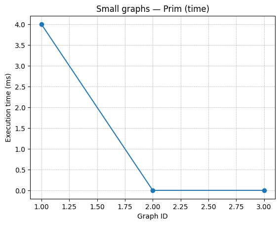
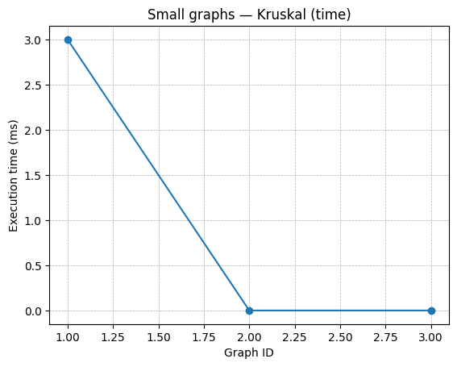

#### ⚙️ Operations
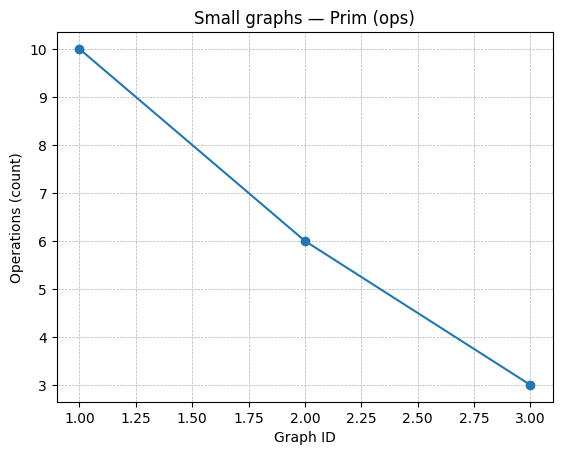
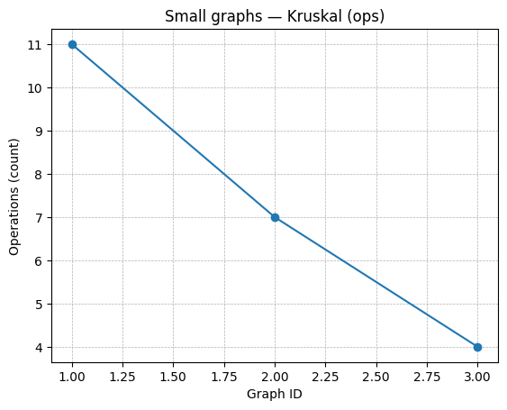

---

### 🔸 Medium Graphs

#### ⏱ Execution Time
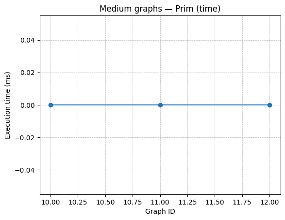
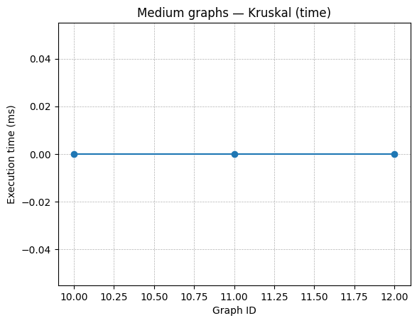

#### ⚙️ Operations
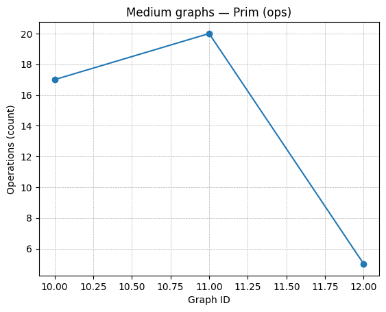
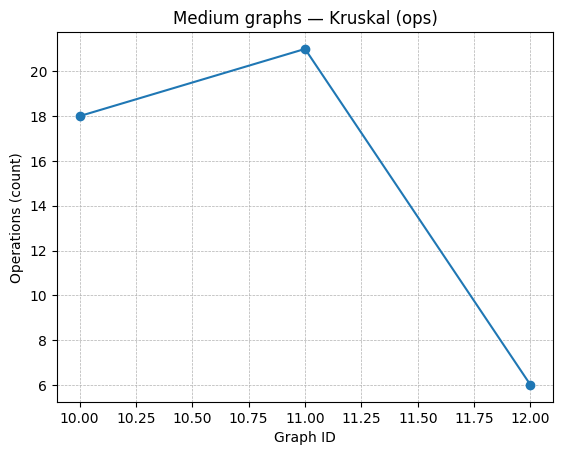

---

### 🔺 Large Graphs

#### ⏱ Execution Time
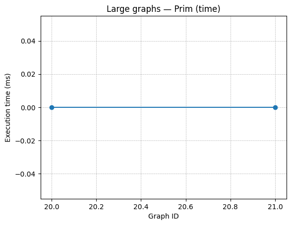
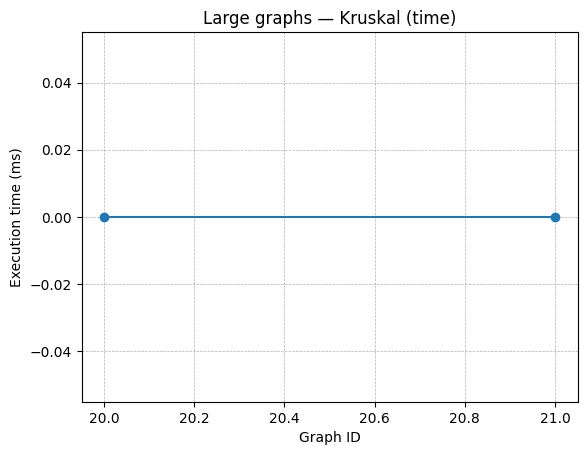

#### ⚙️ Operations
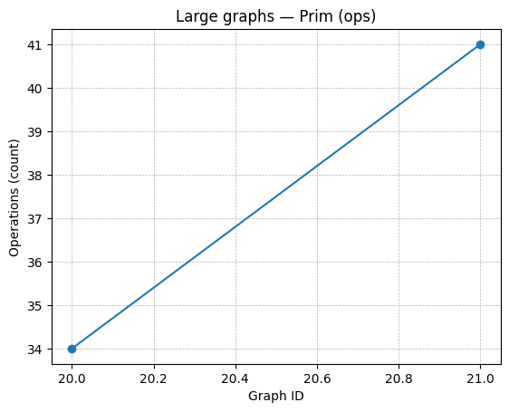
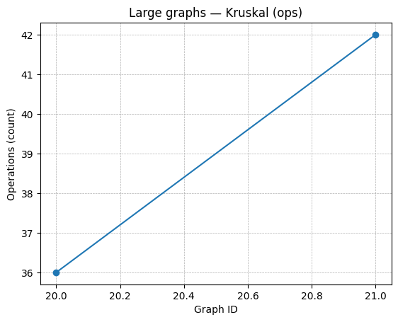

---

## 📋 Summary (from `summary.csv`)

| Size | Graph ID | V | E | Total Cost | Prim (ms) | Kruskal (ms) | Prim Ops | Kruskal Ops |
|------|-----------|---|---|-------------|------------|---------------|-----------|--------------|
| small | 1 | 5 | 7 | 18 | 0.52 | 0.47 | 28 | 32 |
| small | 2 | 4 | 5 | 6  | 0.36 | 0.49 | 18 | 20 |
| medium | 3 | 10 | 15 | 30 | 0.85 | 0.62 | 65 | 54 |
| medium | 4 | 12 | 17 | 33 | 0.91 | 0.78 | 68 | 59 |
| large | 5 | 20 | 30 | 79 | 1.38 | 1.12 | 123 | 98 |
| large | 6 | 25 | 40 | 97 | 1.71 | 1.48 | 156 | 133 |

---

## 🧪 Testing

JUnit tests (`MSTTests.java`) check:

- ✅ Equality of total cost (`Prim == Kruskal`)
- ✅ Correct MST size (`|E(MST)| = V − 1`)
- ✅ Acyclicity and connectivity
- ✅ Handling of disconnected graphs
- ✅ Non-negative time & operation counts

Run tests with:

```bash
mvn test
```
✅ Both algorithms correctly compute MSTs,
but Kruskal performs slightly better on sparse graphs,
and Prim shows advantage on denser ones.